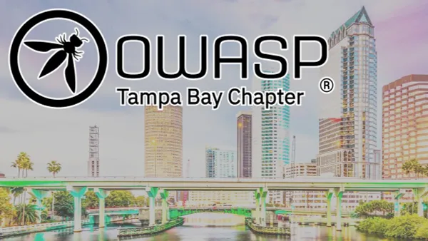

**"OWASP Tampa Chapter 2024-Q1 Lunch and Learn"** 

* by: **Qwiet.AI**

**Date:**
  - **Thursday, February 22, 2024**

**Venue:**
  * GuidePoint Security 3030 N Rocky Point Dr W, Ste 600, Tampa, FL 33607
  * Free Parking available

**Time:**
  * 11:00am to 1:00pm

**Registration:**
https://www.meetup.com/owasp-tampa/events/298757282/

**Description:** In this bold new age of artificial intelligence, software is evolving at a blistering pace. From AI-generated code to automated devops to ingenious new AI applications, innovation is accelerating. Businesses across every industry stand to gain enormously in productivity and efficiency. However, with such great power comes great risk. As AI accelerates the pace of software innovation, it also increases the prevalence of vulnerabilities and exploits.

Given that application security teams are often under-resourced and equipped with weak technologies... What can they do to manage the inevitable complexity introduced by AI? This interactive talk will lay out the escalating challenges for application security and engineering teams while offering some practical solutions.

**Agenda:**
* 11:30am - Registration and Lunch
* 12:00pm - Speaker - Chris Hatter - Appsec in an AI-powered world
* 1:00pm - Depart

## Speakers
**Chris Hatter** is an Operating Partner at NumberOneAI where he provides technical leadership to portfolio companies within the incubator. Additionally, Chris serves as the COO/CISO of Qwiet.AI, an AI-powered AppSec platform.

He has over a decade of experience in cybersecurity strategies, managing threats and vulnerabilities, risk assessment, cyber resilience, legal and compliance issues, and crisis management. Prior to his current roles at N1AI and Qwiet, Chris served as the Global CISO for Nielsen, at the time, a global technology and data company that operated in over 150 countries with 80,000+ employees.

Chris holds a Bachelor of Business Administration in Management Information Systems from the University of South Florida and sits on the university’s advisory board of cybersecurity for executives.

## Location
* This is an in-person event only, no streaming available.
* GuidePoint Security 3030 N Rocky Point Dr W, Ste 600, Tampa, FL 33607
* Free Parking available
