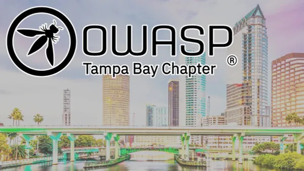

**OWASP Tampa Chapter 2026-April Lunch and Learn** 

**10,000 Lines Before Lunch**

* by: **Aikido Security**

**Date:**
  - **Friday, April 24, 2026**

**Venue:**
  * 3030 N Rocky Point Drive W, Ste 600 · Tampa, FL
  * Free Parking available

**Time:**
  * 11:30am to 1:30pm

**Registration:**
https://www.meetup.com/owasp-tampa/events/314147086/

**Description:** 
10,000 Lines Before Lunch

Your devs are piling on 10k lines before lunch. This is the world we live in. What do you do about it?

**Agenda:**
* 11:30am - Registration and Lunch
* 12:30pm - Speaker - Damien DeHart - 10,000 Lines Before Lunch
* 1:30pm - Depart

## Speakers
**Damien DeHart** comes with a background in Enterprise Observability/Performance Management, where he was a major contributor to New Relic's Observability Maturity Architecture (OMA). Currently working as a Senior Solutions Consultant at Aikido Security, his current role is focused assisting clients with their Vulnerability Management strategy.

## Location
* This is an in-person and streaming events is available.
* GuidePoint Security 3030 N Rocky Point Drive W, Ste 600 · Tampa, FL
* Free Parking available
