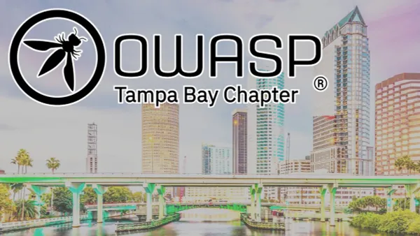

**OWASP Tampa Chapter 2026-August Lunch and Learn** 

**Process Rigor in the age of AI**

* by: **Black DUck**

**Date:**
  - **Friday, August 21, 2026**

**Venue:**
  * 3030 N Rocky Point Drive W, Ste 600 · Tampa, FL
  * Free Parking available

**Time:**
  * 11:30am to 1:30pm

**Registration:**
https://www.meetup.com/owasp-tampa/events/316072459/

**Description:** 
Process Rigor in the age of AI

Attacker attention used to be a scarce resource. That scarcity quietly subsidized the SSDLC of every organization that wasn't safety-critical.  Attention is becoming abundant and subsidized with tokens forcing reconsideration of triage criteria and weakness processes.

**Agenda:**
* 11:30am - Registration and Lunch
* 12:30pm - Speaker - Ed Tice - Process Rigor in the age of AI
* 1:30pm - Depart

## Speakers
**Ed Tice** is a computer scientist whose graduate research focused on monomorphic promotion of virtual call sites for improved static analysis fidelity.  He has worked in both software development and in application security with two decades of experience specifically in applying static analysis to software development lifecycles.

## Location
* This is an in-person and streaming events is available.
* GuidePoint Security 3030 N Rocky Point Drive W, Ste 600 · Tampa, FL
* Free Parking available
